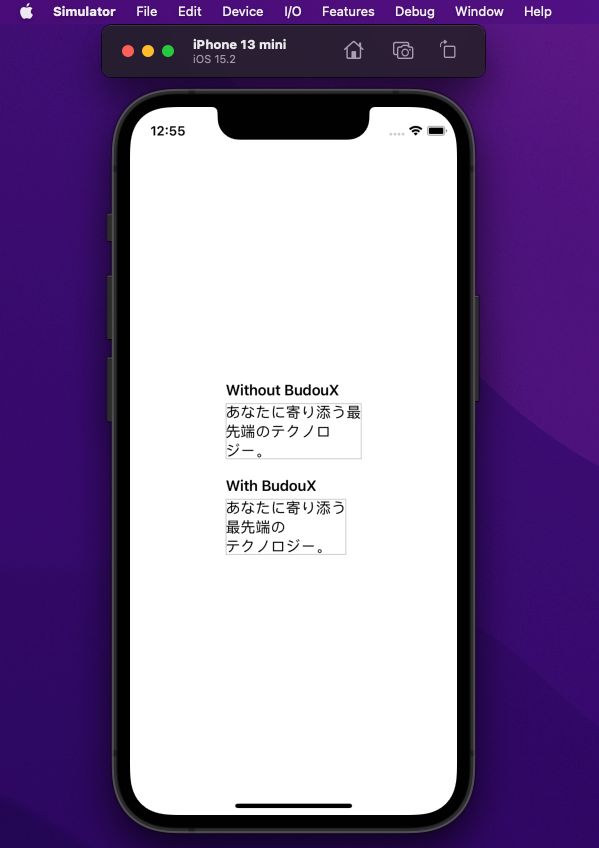

# BudouX.swift

[BudouX](https://github.com/google/budoux) Swift implementation.

BudouX is the machine learning powered line break organizer tool.

## How it works



The original [BudouX](https://github.com/google/budoux) uses HTML markup to ensure that clauses are broken properly. BudouX.swift inserts a `U+2060`(word joiner) and a `U+200B`(zero width space) between each character and clause to ensure that Cocoa's UI component to do the line breaking properly.

Here is a sample project in this repository "Example.swiftpm".

CLI tool `budoux-swift` contains in this repository as well.

## Usage

You can get a list of phrases by feeding a sentence to the parser.

```swift
import BudouX
// Load Default Japanese Parser
let parser = Parser()
// Parse
print(parser.parse("あなたに寄り添う最先端のテクノロジー。"))
// ["あなたに", "寄り添う", "最先端の", "テクノロジー。"]
```

You can also translate an Swift's `String` with word joiners and zero width spaces for semantic line breaks.

```swift
import BudouX
// Load Default Japanese Parser
let parser = Parser()
let sample = "あなたに寄り添う最先端のテクノロジー。"
print(parser.translate(sentence: sample))
// あ⁠な⁠た⁠に​寄⁠り⁠添⁠う​最⁠先⁠端⁠の​テ⁠ク⁠ノ⁠ロ⁠ジ⁠ー⁠。
```

Here's a convinience String extension method as well.

```swift
import BudouX

let sample = "あなたに寄り添う最先端のテクノロジー。"
print(sample.budouxed())
// あ⁠な⁠た⁠に​寄⁠り⁠添⁠う​最⁠先⁠端⁠の​テ⁠ク⁠ノ⁠ロ⁠ジ⁠ー⁠。
```

If you need a function which translate an HTML string by wrapping phrases with non-breaking markup. Here's a support package for it.

[griffin-stewie/HTMLBudouX.swift](https://github.com/griffin-stewie/HTMLBudouX.swift)

### For `SwiftUI.Text`

You can also use methods for SwiftUI's `Text` in iOS 13.0+, macOS 10.15+, Mac Catalyst 13.0+, tvOS 13.0+, and watchOS 6.0+.


```swift
import SwiftUI
import BudouX

struct ContentView: View {
    static let content = "あのイーハトーヴォのすきとおった風、夏でも底に冷たさをもつ青いそら、うつくしい森で飾られたモリーオ市、郊外のぎらぎらひかる草の波。"

    let swiftuiText: SwiftUI.Text = Text(content)
    let budouxText: SwiftUI.Text = BudouXText(content)
    
    var body: some View {
        VStack {
            swiftuiText
            budouxText
        }
        .multilineTextAlignment(.center)
    }
}
```

## Install

Support Swift Package Manager only. There are no plans to support other package management tools at this time.

```swift
package.append(
    .package(url: "https://github.com/griffin-stewie/BudouX.swift", from: "0.4.0")
)

package.targets.append(
    .target(name: "Foo", dependencies: [
        .productItem(name: "BudouX", package: "BudouX.swift")
    ])
)
```

## Update Data from BudouX

For this package maintainer, run following command to update `Sources/BudouX/Data/JaKNBCModel.swift` and `Sources/BudouX/Data/UnicodeBlocks.swift` from [original BudouX](https://github.com/google/budoux).

```sh
make generate_data 
```
